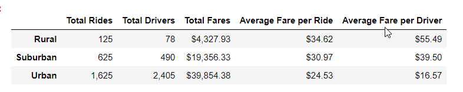
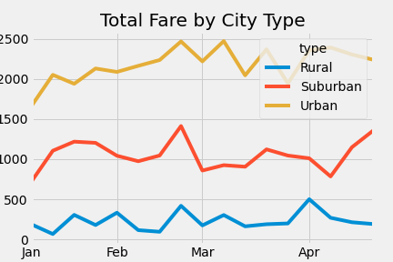

# PyBer_Analysis

## Overview

The purpose of this analysis is to examine all the rideshare data from January to early May of 2019 across various cities in Urban, Suburban, and Rural areas. Pandas and Matplotlib will be used to perform the analysis. With the results of this analysis we will be able to provide the CEO of Pyber visuals to assess their rideshare business across multiple cities. A summary DataFrame of the ride-sharing data by city type along with a multiple-line graph that shows the total weekly fares for each city type will be provided to the CEO.

## Results

**Data Summary**

Urban cities had more Total Rides, Total Drivers, and Total Fares in comparison to Rural and Suburban cities. However, Rural cities had higher Average Fares per Ride and per Driver as compared to Suburban and Urban cities.

** Refer to the table below for a detailed breakdown of Total Rides, Total Drivers, Total Fares, Average Fare per Ride, and Average Fare per Driver, grouped by the city type of Rural, Suburban, and Urban. 

The results of the Data Summary by city type were as followed:
*	**Total Rides:** 13-times more Urban rides than Rural (1625 v 125) ; over 2.5-times more Urban rides than Suburban (1625 v 625) rides. 

*	**Total Drivers:** More than 30-times the number of drivers in Urban cities compared to Rural cities (2,405 v 78), approx.; five-times more drivers in Urban cities compared to Suburban drivers (2,405 v 490). 

* **Total Fares:** 9-times more total fare in Urban cities compared to Rural cities ($39,854.38 v $4,327.93); 2-times more total fare in Urban cities vs Suburban cities ($39,854.38 v $19,356.33)

*	**Average Fare per Ride:** Average fare per ride was about $10 more in Rural cities vs Urban cities ($34.62 v $24.53); approx. $4 more in Rural vs Suburban cities $34.62 v $30.97)

* **Average Fare per Driver:** Average fare per driver about $39 more in Rural cities vs Urban cities ($55.49 vs $16.57); $16 more in Rural vs Suburban cities ($55.49 v $39.50)

**Graph**

The graph shows fare trends by city type from January 2019 to April 2019. Based on the graph we can see that Urban cities had the highest total fares consistently throughout the timeframe analyzed, followed by Suburban, and Rural cities. 

 

## Summary: 
Based on the results of the analysis, three business recommendations to the CEO to address the disparities among the city types are as follows:

**a)**	Increase the number of drivers in Rural areas to generate additional revenue for Pyber. Increasing the number of drivers may decrease the average fare per ride, which could encourage more usage of Pyber rideshare. 

**b)**	The end of February seems to generate the high revenue across all cities with this trend lasting until around April.  Pyber can take advantage of this by increasing the number of drivers that are available during this time. 

**c)**	Focus on growing the Suburban business. The potential for growth in rural areas may be hindered by population and proximity of destinations. Urban cities may run into issues with market saturation. Suburbs provide the unique opportunity for market share growth due to not as much competition and the migration of people from urban cities to suburban cities.  

